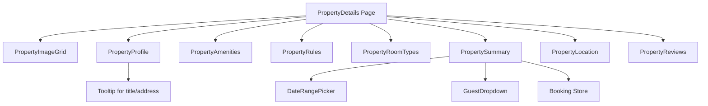

# Property Details Module

## Overview

This module provides a comprehensive property details page for the property renting application. It displays detailed information about a property, including images, profile, amenities, rules, room types, location, reviews, and booking functionality.

The page now uses TanStack Query for data fetching from the `/api/properties/[id]` endpoint, with Axios for HTTP requests. Data is fetched once and distributed to child components via props.

## File Structure

```
src/app/(properties)/property-details/
├── layout.tsx                 # Page layout component
├── page.tsx                   # Main property details page
├── README.md                  # This documentation
└── _components/
    ├── property.amenities.tsx     # Amenities display
    ├── property.image.grid.tsx    # Property images grid
    ├── property.location.tsx      # Location/map display
    ├── property.navbar.tsx        # Navigation component
    ├── property.profile.tsx       # Property title, rating, description
    ├── property.reviews.tsx       # User reviews section
    ├── property.room.types.tsx    # Available room types
    ├── property.rules.tsx         # House rules
    └── property.summary.tsx       # Booking summary widget
```

## Component Relationships



## Components Description

### PropertyImageGrid

Displays a grid of property images.

### PropertyProfile

Shows property title, address, rating, host information, and description with expandable text.

### PropertyAmenities

Lists available amenities with icons, with show more/less functionality.

### PropertyRules

Displays house rules and policies.

### PropertyRoomTypes

Shows different room options available for booking.

### PropertySummary

Booking widget with date selection, guest count, price breakdown, and booking button. Integrates with booking store.

### PropertyLocation

Displays property location information and map.

### PropertyReviews

Shows user reviews and ratings.

### PropertyNavbar

Navigation component (not currently used in main page).

## Data Fetching

The property details page uses TanStack Query (`useQuery`) to fetch data from the API endpoint `/api/properties/[id]`. The implementation includes:

- **Hook**: `fetchPropertyById` in `src/hooks/api/use.fetch.property.ts` using Axios
- **Types**: TypeScript interfaces in `src/types/property.ts`
- **Query**: `useQuery` in `page.tsx` with loading and error states
- **Props Distribution**: Fetched data is passed to components via props

### Data Flow

```
API (/api/properties/[id]) → fetchPropertyById → useQuery → page.tsx → Component Props
```

### Component Props

- `PropertyImageGrid`: `images` (PropertyImage[])
- `PropertyProfile`: `title`, `rating`, `description`, `host`, `category`, `reviews`, `address`
- `PropertyAmenities`: `amenities` (Amenities object)
- `PropertyRules`: `rules` (Rules object)
- `PropertyRoomTypes`: `rooms` (Room[])
- `PropertyLocation`: `address`, `city`, `country`, `postalCode`, `latitude`, `longitude`

## Dependencies

- React
- Next.js
- TanStack Query (for data fetching)
- Axios (for HTTP requests)
- Lucide React (for icons)
- Zustand (for booking store)
- React Day Picker (for date selection)
- Tailwind CSS (for styling)

## Usage

This module is part of a Next.js app route group. Access it via `/property-details?id=1` where the ID parameter is extracted from the URL params.

The page fetches property data using TanStack Query and handles loading/error states. Components receive data via props and use Zustand store for booking state management.

### Error Handling

- **Loading State**: Shows spinner and loading message
- **Error State**: Shows error message with retry suggestion
- **Not Found**: Shows not found message for invalid property IDs

### TypeScript Support

All components are fully typed with TypeScript interfaces defined in `src/types/property.ts`.
