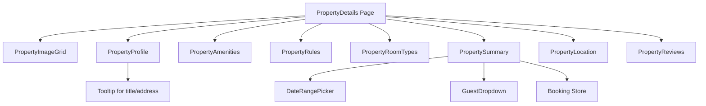

# Property Details Module

## Overview

This module provides a comprehensive property details page for the property renting application. It displays detailed information about a property, including images, profile, amenities, rules, room types, location, reviews, and booking functionality.

## File Structure

```
src/app/(properties)/property-details/
├── layout.tsx                 # Page layout component
├── page.tsx                   # Main property details page
├── README.md                  # This documentation
└── _components/
    ├── property.amenities.tsx     # Amenities display
    ├── property.image.grid.tsx    # Property images grid
    ├── property.location.tsx      # Location/map display
    ├── property.navbar.tsx        # Navigation component
    ├── property.profile.tsx       # Property title, rating, description
    ├── property.reviews.tsx       # User reviews section
    ├── property.room.types.tsx    # Available room types
    ├── property.rules.tsx         # House rules
    └── property.summary.tsx       # Booking summary widget
```

## Component Relationships



## Components Description

### PropertyImageGrid

Displays a grid of property images.

### PropertyProfile

Shows property title, address, rating, host information, and description with expandable text.

### PropertyAmenities

Lists available amenities with icons, with show more/less functionality.

### PropertyRules

Displays house rules and policies.

### PropertyRoomTypes

Shows different room options available for booking.

### PropertySummary

Booking widget with date selection, guest count, price breakdown, and booking button. Integrates with booking store.

### PropertyLocation

Displays property location information and map.

### PropertyReviews

Shows user reviews and ratings.

### PropertyNavbar

Navigation component (not currently used in main page).

## Dependencies

- React
- Next.js
- Lucide React (for icons)
- Zustand (for booking store)
- React Day Picker (for date selection)
- Tailwind CSS (for styling)

## Usage

This module is part of a Next.js app route group. Access it via `/properties/[id]` where `[id]` is the property ID.

The page expects property data to be available (currently uses sample data). Components use Zustand store for booking state management.

To integrate with API, replace sample data in components with actual API calls.
